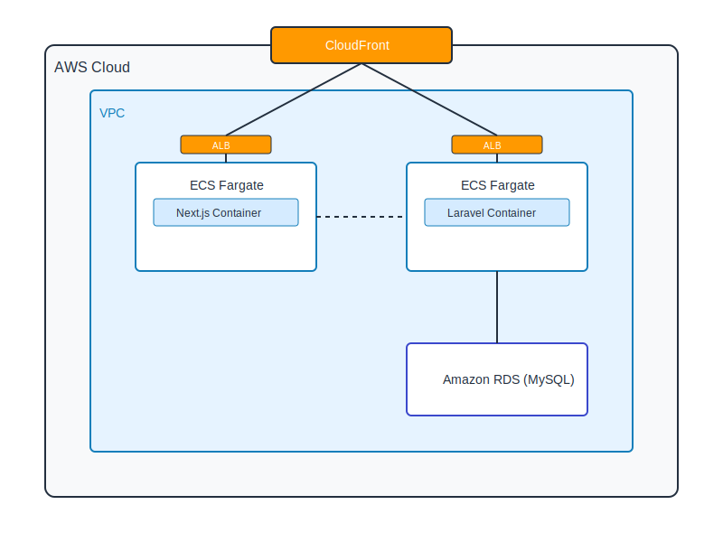

# Next.js + Laravel Example with AWS CDK

このプロジェクトは、Next.js（フロントエンド）とLaravel（バックエンド）を組み合わせた、AWSインフラストラクチャ上で動作するアプリケーションのサンプルです。

## アーキテクチャ



### コンポーネント
- **フロントエンド**: Next.js（SSRとスタティックページ）
- **バックエンド**: Laravel API
- **データベース**: Amazon RDS (MySQL)
- **インフラストラクチャ**:
  - Amazon ECS Fargate（Next.jsとLaravelのコンテナ実行）
  - Application Load Balancer
  - Amazon CloudFront（CDN）
  - Amazon RDS for MySQL
  - AWS Secrets Manager（データベース認証情報）

## 前提条件

- Node.js (v18以上)
- AWS CLI（設定済み）
- Docker Desktop
- PHP 8.2以上（ローカル開発用）
- Composer（ローカル開発用）

## プロジェクト構造

```
.
├── app/                    # Laravel アプリケーション
│   ├── src/               # Laravel ソースコード
│   └── Dockerfile         # Laravel用 Dockerfile
├── nextjs/                # Next.js アプリケーション
│   ├── pages/             # Next.jsページ
│   └── Dockerfile        # Next.js用 Dockerfile
├── lib/                   # CDK スタック定義
├── bin/                   # CDK エントリーポイント
└── cdk.json              # CDK 設定
```

## セットアップ手順

1. リポジトリのクローン
```bash
git clone [your-repo-url]
cd [your-repo-name]
```

2. 依存関係のインストール
```bash
# CDKプロジェクトの依存関係
npm install

# Next.jsアプリケーションの依存関係
cd nextjs
npm install
cd ..

# Laravelアプリケーションの依存関係（ローカル開発時）
cd app
composer install
cd ..
```

3. ローカル開発環境の起動
```bash
# Docker Composeを使用してローカル環境を起動
docker-compose up
```

## デプロイ方法

1. AWSクレデンシャルの設定
```bash
aws configure
```

2. CDKの初期化（初回のみ）
```bash
cdk bootstrap
```

3. アプリケーションのデプロイ
```bash
# Next.jsアプリケーションのビルド
cd nextjs
npm run build
cd ..

# CDKスタックのデプロイ
cdk deploy
```

## 開発環境

### ローカル開発

1. Laravel API
```bash
cd app
php artisan serve
```

2. Next.jsアプリケーション
```bash
cd nextjs
npm run dev
```

### Docker環境

```bash
docker-compose up
```

## エンドポイント

デプロイ後、以下のエンドポイントが利用可能になります：

- **フロントエンド**: CloudFrontのドメイン（CDKデプロイ後に出力されます）
  - `/` - スタティックページ
  - `/samples` - データベースからのサンプルデータ表示（SSR）
- **API**: `/api/samples` - サンプルデータのJSON API

## 環境変数

### Laravel
- `APP_ENV`
- `DB_HOST`
- `DB_DATABASE`
- `DB_USERNAME`
- `DB_PASSWORD`

### Next.js
- `API_URL` - Laravel APIのエンドポイント

## 課題やフィードバック

問題やフィードバックは、GitHubのIssuesでお知らせください。

## ライセンス

[MIT License](LICENSE)